# AWS Monitoring Project Screenshots

### Step 1 – EC2 Setup
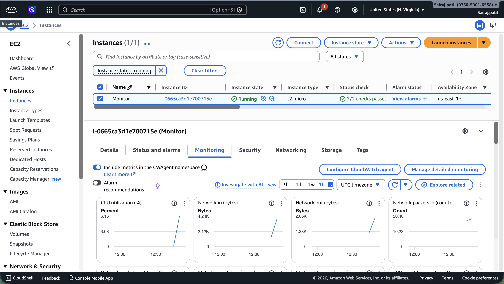

### Step 2 – SNS Setup
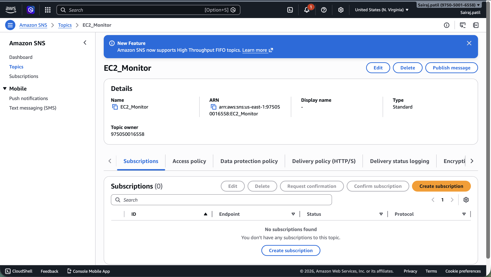
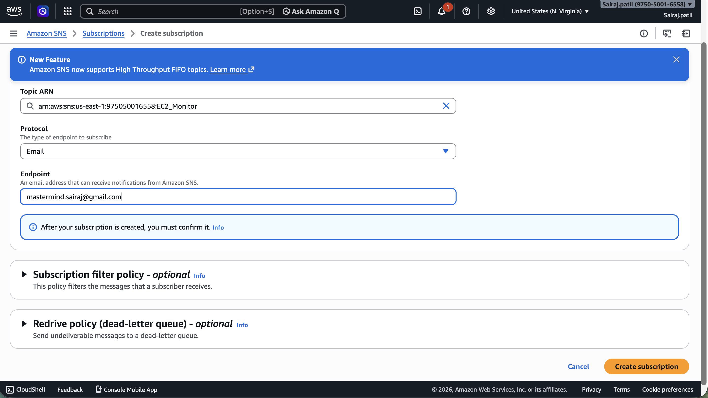
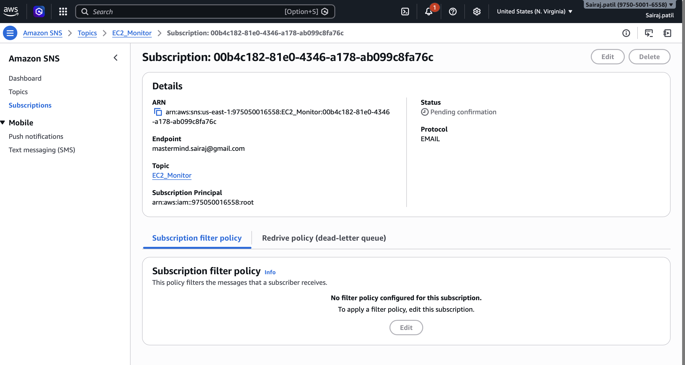

### Step 3 – Subscription Confirmation
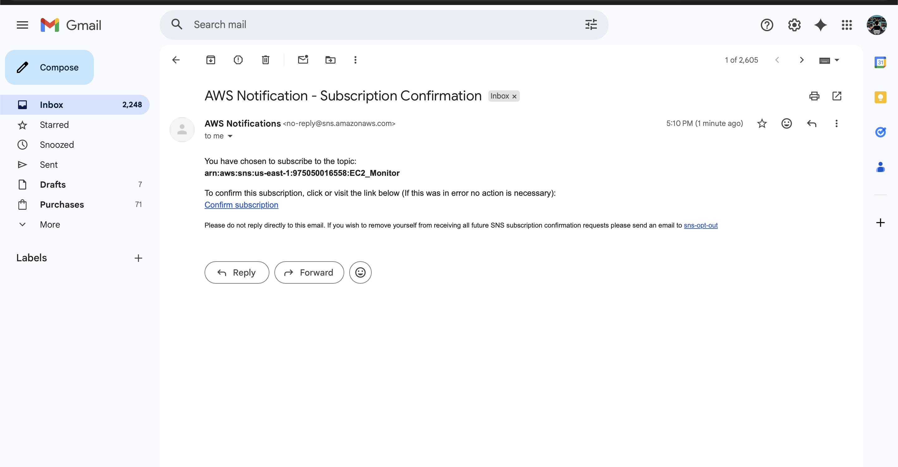
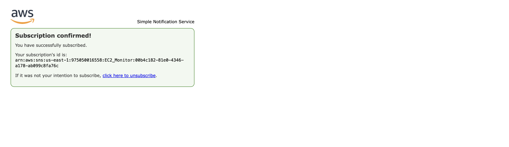

### Step 4 – Access Policy Change
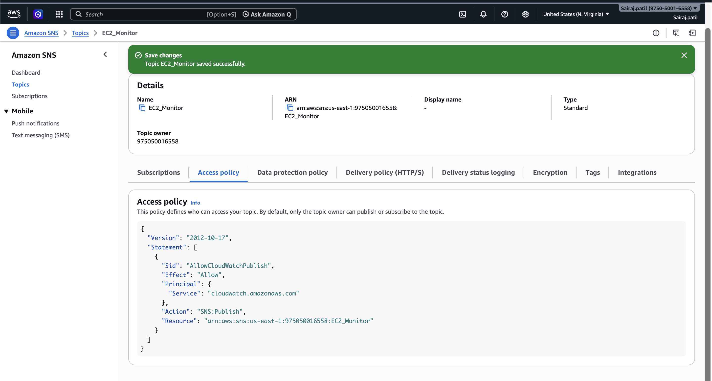

### Step 5 – CloudWatch Alarms
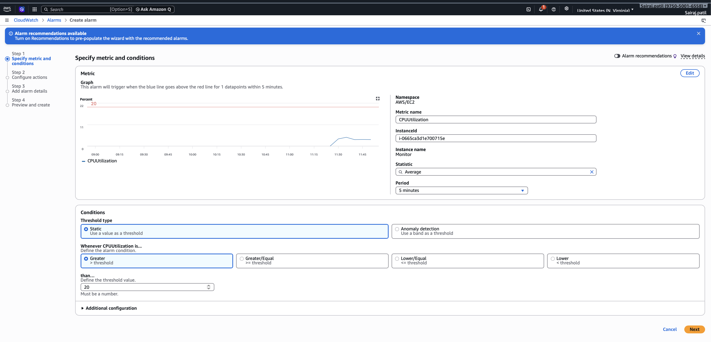
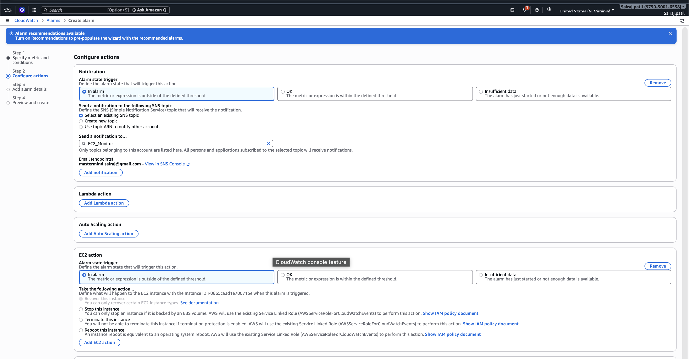
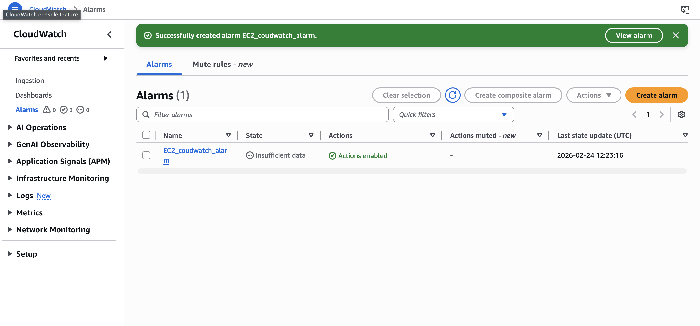

### Step 6 – Alarm Details & Monitoring
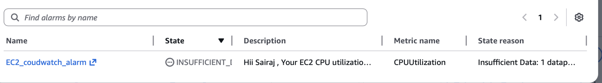
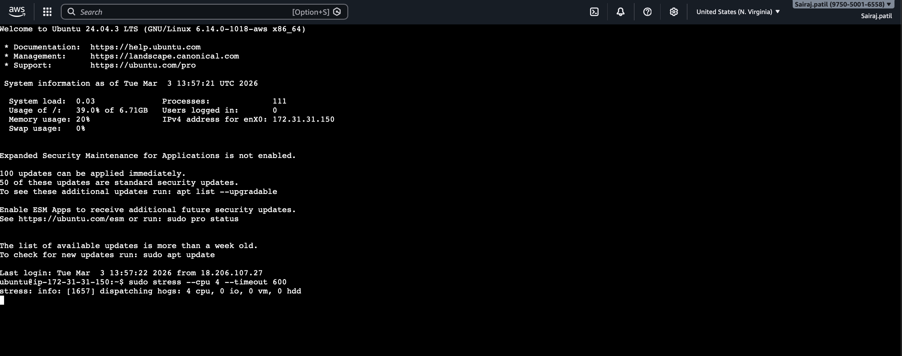
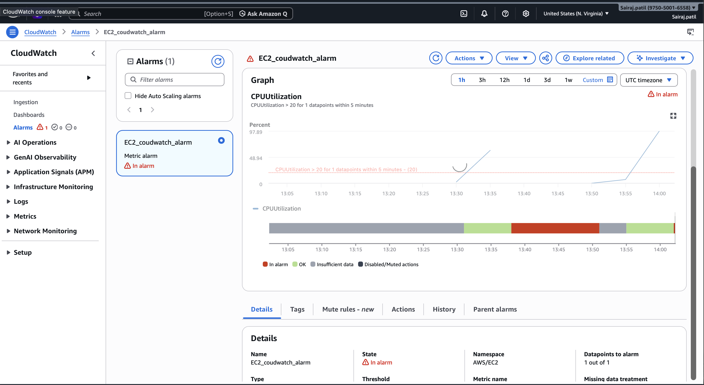
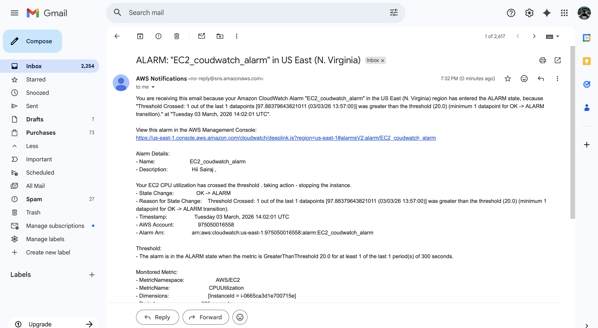
